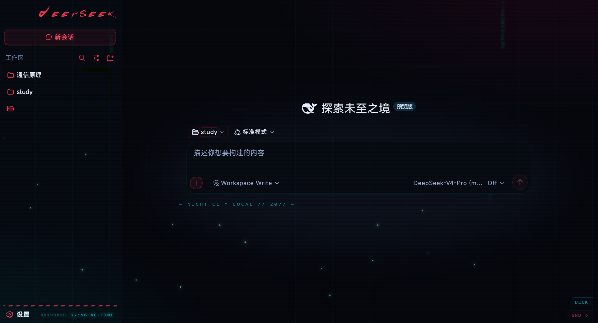
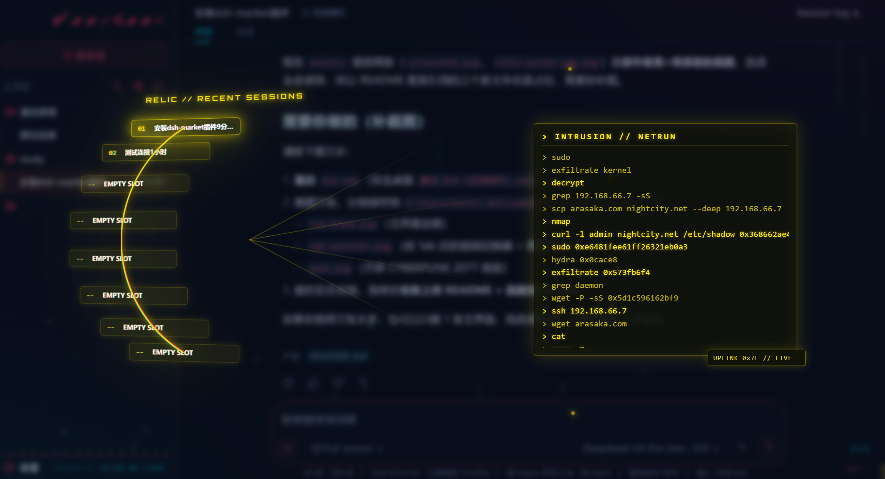
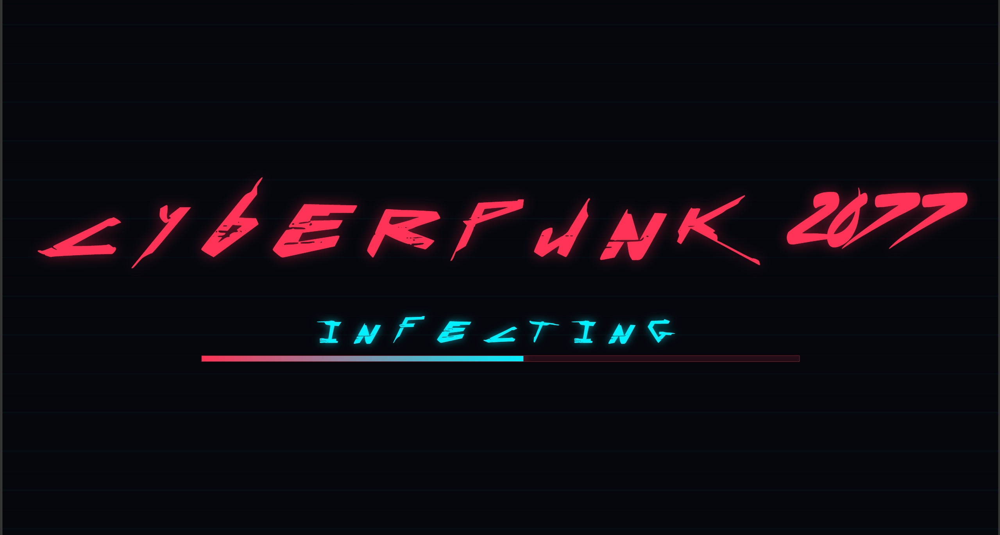

# dsh-theme-cyberpunk-red

赛博朋克 2077「夜之城」红 × 青 × 绿霓虹主题 —— DeepSeek Harness Web UI 皮肤插件（**dsh-plugin**）。

改自 [Tommy00748/dsh-theme-cyberpunk2077](https://github.com/Tommy00748/dsh-theme-cyberpunk2077)，感谢原作者。

## 功能特点

- **霓虹红 × 青 × 绿配色**，深色背景，赛博朋克夜之城风格
- **内嵌字体**：Ryzes（赛博涂鸦）、Cyberpunk、Orbitron 均 base64 内嵌，无需联网加载
- **开屏动画**：CYBERPUNK 2077 大字 + INFECTING 载入进度条 + CRT 扫描线转场
- **Tab 病毒槽切换**：按 Tab 呼出左侧 120° 弧线会话切换器，最近对话置顶，滚轮选择，中右弹出黑客命令行终端
- **绿色代码雨粒子背景** + 藏青色底，电子码氛围
- 隐藏彩蛋：发送 `relic` / `johnny` 触发全屏特效

## 安装

```sh
dsh plugin --profile web add github:GGbao-114/Cyberpunk-theme-for-dsh
```

安装后重启 `dsh web` 生效。

## 截图







## 许可

MIT。字体版权归各自作者所有。
